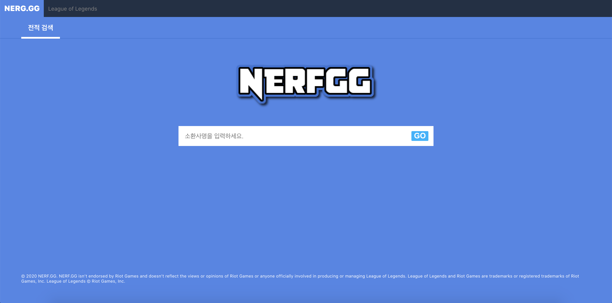
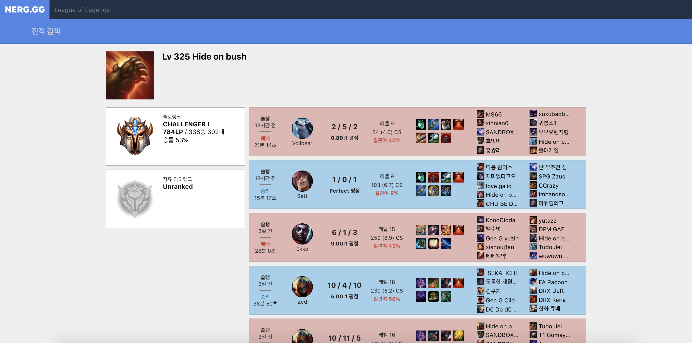
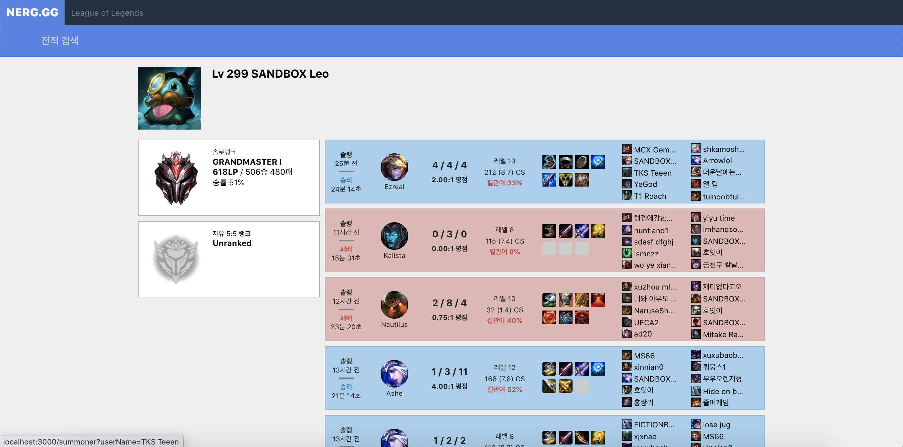
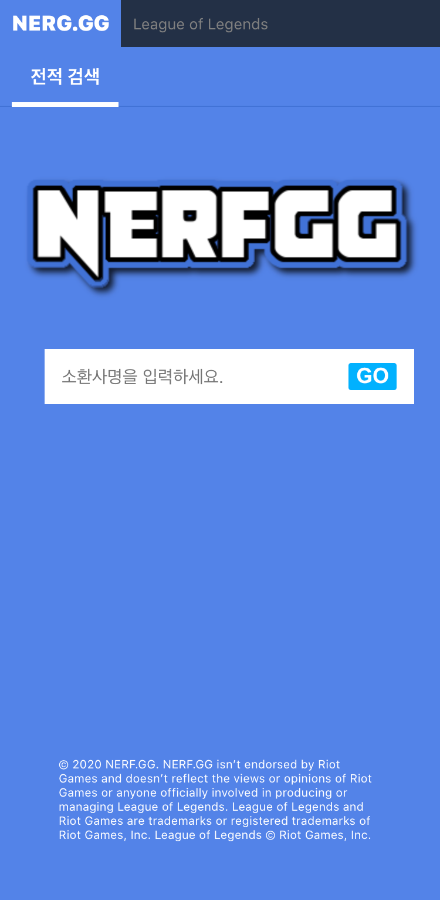
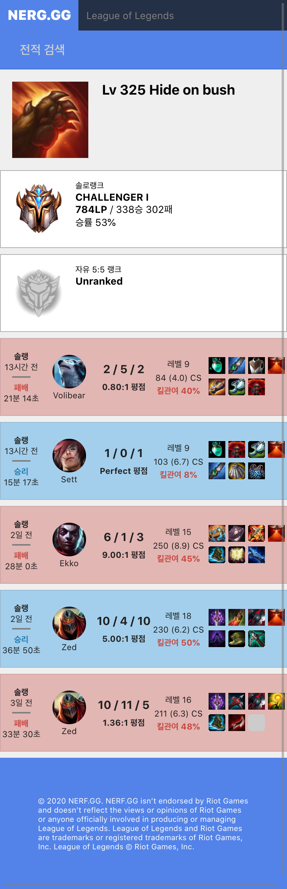

This project was bootstrapped with [Create React App](https://github.com/facebook/create-react-app).

# NERFGG

React.js의 기본을 익히고 컨테이너, 컴포넌트 구조를 이해해보기 위해 만들어 본 리그 오브 레전드 전적 검색 사이트 [OP.GG](https://www.op.gg) 클론 코딩 프로젝트

## 개요

5월 한 달간 [OP.GG](https://www.op.gg/)의 전적검색 탭을 확인하며 최대한 비슷하게 제작.

최대한 외부 라이브러리에 대한 의존없이 기본에 충실히 웹사이트를 제작하는 것에 중점을 둠.

사용한 외부 라이브러리는 제작 시간 절약을 위해 URL 파싱을 위한 `query-string`, 그리고 게임이 플레이된 시간을 계산하기 위한 `moment.js`만 사용.

## 내용

1. 구조
  - `src/client` : 브라우저 측에서 사용할 최상위 컴포넌트인 `Root.js`가 위치해있음. `react-router`를 사용하기 때문에 여기서 라우터를 설정해줌.
  - `src/pages` : 각 라우트들이 위치하는 디렉토리. 처음 접속했을 때 나타나는 `MainContainer.js`와 소환사명을 검색해 전적을 확인할 때 나타나는 `SummonerContainer.js`로 구분. `state`들을 관리하고 데이터를 작업하기 위한 컨테이너들로 구성되있음.
  - `src/components` : 프로젝트를 구성하는 컴포넌트들이 모두 위치해있음. `props`로 전달받은 값을 렌더링하고 CSS 스타일을 가지고 웹을 꾸며주는 역할을 함.
  - `src/server` : 서버 측에서 사용하는 코드들을 넣어둠. `axios`를 이용해 RIOT API를 통해 각 소환사들의 정보를 받아옴.
  - `src/shared` : 서버와 클라이언트에서 공용으로 사용되는 컴포넌트인 `App.js`가 위치함.

## 실행 화면

1. 데스크탑
  - 메인
    

  - 'hide on bush' 전적 검색
    

  - 같은 매치에 있었던 다른 소환사 전적 검색
    

2. 모바일
  - 메인
    

  - 'hide on bush' 전적 검색
    